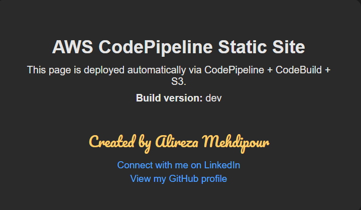

# AWS CodePipeline Static Website Deployment

This project demonstrates a fully automated CI/CD pipeline for deploying a static website to Amazon S3 using **AWS CodePipeline**, **AWS CodeBuild**, and **GitHub**.  
It includes automated testing, build version injection, artifact packaging, and S3 static website hosting.

---

## Architecture Overview

**Pipeline Flow:**  
**GitHub → CodePipeline → CodeBuild → S3 (Static Website Hosting)**

### Components

- **GitHub** – Stores the source code  
- **AWS CodePipeline** – Orchestrates the CI/CD workflow  
- **AWS CodeBuild** – Runs tests, injects build version, and prepares artifacts  
- **Amazon S3** – Hosts the static website  
- **Bash + Python** – Used for testing and version injection  

---

## Project Structure

```
.
├── app/
│   ├── index.html
│   └── style.css
├── scripts/
│   └── inject_version.py
├── tests/
│   └── app.test.sh
├── buildspec.yml
└── README.md
```

---

## Features

- Fully automated CI/CD pipeline using AWS CodePipeline  
- Build version injection using Python  
- Pre‑build validation and testing using Bash  
- Automatic deployment to an S3 static website bucket  
- Clean, modular, and production‑ready project structure  

---

## Testing

The script at `tests/app.test.sh` validates:

- Required files exist  
- Directory structure is correct  

These tests run during the **pre_build** phase in CodeBuild.

---

## Build Process (buildspec.yml)

The build pipeline includes:

### **1. Install Phase**
- Prints Python and Bash versions  
- Prepares the environment  

### **2. Pre‑build Phase**
- Executes test scripts  
- Validates project structure  

### **3. Build Phase**
- Generates a timestamped `BUILD_VERSION`  
- Logs build metadata  

### **4. Post‑build Phase**
- Copies files into the `dist/` directory  
- Injects the build version into HTML  
- Prepares final artifacts for deployment  

---

## Deployment

The final build artifacts are deployed to an **S3 bucket configured for static website hosting**.

---

## Live Demo

The static website is deployed to Amazon S3 and available at:

http://alireza-static-site-pipeline-01.s3-website-us-east-1.amazonaws.com/



---

## Technologies Used

- **AWS CodePipeline** –> CI/CD orchestration  
- **AWS CodeBuild** –> Build and test execution  
- **Amazon S3** –> Static website hosting  
- **GitHub** –> Source control and collaboration  
- **Bash** –> Test and validation scripts  
- **Python** –> Build version injection  

---

## How to Deploy Your Own Version

1. **Fork this repository** to your own GitHub account.  
2. **Create an S3 bucket** and enable static website hosting.  
3. **Create a CodeBuild project** that uses this repo and `buildspec.yml`.  
4. **Create a CodePipeline pipeline** with:
   - Source: GitHub (this repo)  
   - Build: CodeBuild project  
   - Deploy: S3 bucket  

5. Commit a change to `main` and watch the pipeline run and deploy automatically.

*(You can adapt these steps to match your preferred AWS setup.)*

---

## Future Improvements

- Add HTML/CSS linting or automated UI tests  
- Use AWS CloudFormation or CDK to define the pipeline as code  
- Add GitHub Actions workflow for additional checks  
- Support multiple environments (dev/stage/prod)  

---

## Summary

This project demonstrates a complete, automated CI/CD workflow for static website deployment using AWS-native services.  
It’s a practical example of DevOps automation, infrastructure best practices, and clean project design.
