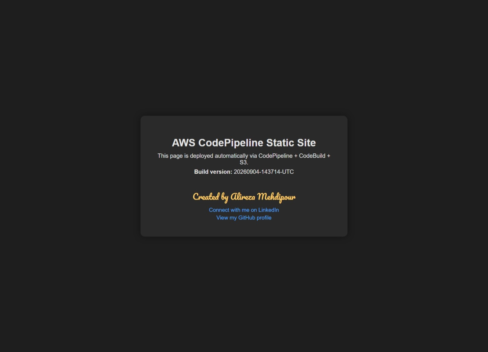
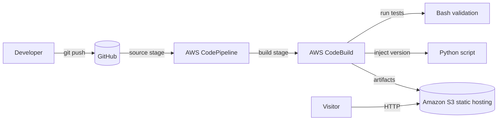

# AWS CodePipeline Static Website Deployment

[](https://github.com/Alireza-Mehdipour/aws-codepipeline-static-site/actions/workflows/ci.yml)

A fully automated CI/CD pipeline that deploys a static website to Amazon S3 using AWS CodePipeline, AWS CodeBuild and GitHub, with automated testing, build version injection and artifact packaging along the way.

I built this independently to practice and consolidate the CI/CD and deployment automation concepts I picked up through AWS training and hands-on work experience. The aim was a pipeline that does real work on every commit rather than just copying files to a bucket: validate the project first, stamp the build with a traceable version, then deploy.

---

## Live Demo

The site is deployed and running at:

**http://alireza-static-site-pipeline-01.s3-website-us-east-1.amazonaws.com/**



Every commit to `main` triggers the pipeline and updates this site automatically.

---

## Architecture


```mermaid
flowchart LR
    Dev[Developer] -->|git push| GH[(GitHub)]
    GH -->|source stage| CP[AWS CodePipeline]
    CP -->|build stage| CB[AWS CodeBuild]
    CB -->|run tests| T[Bash validation]
    CB -->|inject version| PY[Python script]
    CB -->|artifacts| S3[(Amazon S3 static hosting)]
    User[Visitor] -->|HTTP| S3
```

**Pipeline flow:** GitHub to CodePipeline to CodeBuild to S3.

| Component | Role in this project |
|---|---|
| GitHub | Source control and pipeline trigger |
| AWS CodePipeline | Orchestrates the CI/CD workflow across stages |
| AWS CodeBuild | Runs tests, injects the build version, prepares artifacts |
| Amazon S3 | Hosts the static website |
| Bash | Pre-build validation and testing |
| Python | Build version injection into the HTML |

---

## Design Decisions

**Why CodePipeline rather than GitHub Actions alone.** GitHub Actions could deploy to S3 in a handful of lines. The point here was to build the pipeline with AWS-native tooling, which is what most AWS shops actually run, and to work directly with the stage and artifact model CodePipeline uses. The GitHub Actions workflow in this repo does something different, covered below.

**Why a separate pre-build validation stage.** Running the Bash checks before the build phase means a missing file or a broken directory structure fails fast, before any artifact is produced or anything reaches S3. Catching it at the deploy step would mean a broken site is already live.

**Why inject a build version.** Every deployment gets a timestamped `BUILD_VERSION` stamped into the HTML. Without it, there is no way to tell from a browser which build you are looking at, which makes it impossible to confirm a deployment actually landed or to trace a problem back to a specific run.

**Why Python for injection and Bash for tests.** Bash is the natural fit for file and structure checks inside a CodeBuild environment. Python handles the HTML manipulation more safely than string substitution in shell would.

**Why a `dist/` directory in post-build.** Keeping the built output separate from source means only intended files are packaged and deployed. Deploying straight from the source directory risks shipping test scripts, configuration or anything else that happens to be sitting there.

---

## Project Structure

```
.
├── app/
│   ├── index.html
│   └── style.css
├── scripts/
│   └── inject_version.py
├── tests/
│   └── app.test.sh
├── .github/workflows/
├── buildspec.yml
└── README.md
```

---

## Build Process (buildspec.yml)

**1. Install phase.** Prints Python and Bash versions and prepares the build environment.

**2. Pre-build phase.** Executes the test scripts and validates the project structure. The build stops here if anything fails.

**3. Build phase.** Generates a timestamped `BUILD_VERSION` and logs build metadata.

**4. Post-build phase.** Copies files into `dist/`, injects the build version into the HTML, and prepares the final artifacts for deployment.

---

## Testing

The script at `tests/app.test.sh` validates that required files exist and the directory structure is correct. These run during the `pre_build` phase in CodeBuild, so a structural problem fails the build before an artifact is ever produced.

---

## Continuous Integration

This repo runs two complementary automations, which is worth clarifying since they overlap:

- **AWS CodePipeline** handles the deployment path: source, build, test and release to S3.
- **GitHub Actions** (the badge at the top) runs the same validation scripts on every push and pull request, giving fast feedback directly in GitHub without waiting on a full pipeline execution.

---

## Deployment

Build artifacts are deployed to an S3 bucket configured for static website hosting. The pipeline runs automatically on every commit to `main`.

---

## Prerequisites

- AWS account with permissions for CodePipeline, CodeBuild, S3 and IAM
- A GitHub account and repository connection configured in CodePipeline
- AWS CLI v2 if you want to inspect or manage resources from the terminal

---

## Deploying Your Own Version

1. **Fork this repository** to your own GitHub account.
2. **Create an S3 bucket** and enable static website hosting on it.
3. **Create a CodeBuild project** pointing at your fork, using `buildspec.yml`.
4. **Create a CodePipeline pipeline** with three stages:
   - Source: GitHub (your fork)
   - Build: the CodeBuild project from step 3
   - Deploy: your S3 bucket
5. **Commit a change to `main`** and watch the pipeline run and deploy automatically.

Adapt the steps to match your preferred AWS setup and region.

---

## Known Limitations and Next Steps

This is a portfolio project, and a production deployment would need more than is here:

- **No HTTPS or custom domain.** The site is served over HTTP from the raw S3 website endpoint. Production would put CloudFront in front with an ACM certificate and a Route 53 record.
- **Pipeline is defined manually.** The pipeline itself was created in the console rather than as code. Defining it with CloudFormation, CDK or Terraform would make it reproducible, which is the same principle applied in my [fargate-data-ingestion](https://github.com/Alireza-Mehdipour/fargate-data-ingestion) project.
- **Single environment.** No dev, staging or production separation.
- **Testing is structural only.** The Bash checks confirm files exist but do not validate HTML or CSS. Linting or automated UI tests would be the next addition.
- **No lifecycle or cost tagging** on the S3 bucket.

---

## Author

**Alireza Mehdipour**
Cloud and DevOps Engineer, Melbourne
LinkedIn: [linkedin.com/in/ali-mehdipour-886686229](https://www.linkedin.com/in/ali-mehdipour-886686229/)
GitHub: [github.com/Alireza-Mehdipour](https://github.com/Alireza-Mehdipour)

---

## License

MIT License. Free to use, modify and share.
